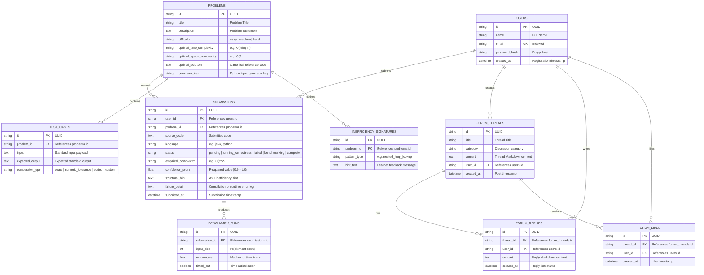

# AlgoLens — Database Design & Data Dictionary

## 1. Entity-Relationship Diagram (ERD)

### Visual Representation (Mermaid)

---

## 2. Data Dictionary

### 2.1 Table: `users`
Represents registered users (learners, developers, administrators).

| Column Name | Data Type | Constraints | Default | Description |
|---|---|---|---|---|
| `id` | `VARCHAR(36)` | PRIMARY KEY | UUIDv4 | Unique identifier for the user. |
| `name` | `VARCHAR(120)` | NOT NULL | None | Full display name of the user. |
| `email` | `VARCHAR(255)` | NOT NULL, UNIQUE, INDEX | None | User's unique login email address. |
| `password_hash` | `VARCHAR(255)` | NOT NULL | None | Bcrypt password hash (never stored in plaintext). |
| `created_at` | `TIMESTAMP` | NOT NULL | `CURRENT_TIMESTAMP` | Account registration timestamp. |

---

### 2.2 Table: `problems`
Stores algorithmic problem definitions, theoretical complexity baselines, and generator keys.

| Column Name | Data Type | Constraints | Default | Description |
|---|---|---|---|---|
| `id` | `VARCHAR(36)` | PRIMARY KEY | UUIDv4 | Unique identifier for the problem. |
| `title` | `VARCHAR(200)` | NOT NULL | None | Short title of the problem. |
| `description` | `TEXT` | NOT NULL | None | Full problem statement (supports Markdown). |
| `difficulty` | `VARCHAR(20)` | NOT NULL | None | Difficulty level (`easy`, `medium`, `hard`). |
| `optimal_time_complexity` | `VARCHAR(30)` | NOT NULL | None | Target asymptotic time complexity (e.g., `O(n)`, `O(n log n)`). |
| `optimal_space_complexity` | `VARCHAR(30)` | NOT NULL | None | Target auxiliary space complexity (e.g., `O(1)`, `O(n)`). |
| `optimal_solution` | `TEXT` | NULLABLE | `NULL` | Canonical reference solution implementation. |
| `generator_key` | `VARCHAR(80)` | NOT NULL | None | Module key mapping to `app/problems_data/<key>.py` input generator. |

---

### 2.3 Table: `test_cases`
Fixed test cases evaluated during the correctness phase before benchmarking.

| Column Name | Data Type | Constraints | Default | Description |
|---|---|---|---|---|
| `id` | `VARCHAR(36)` | PRIMARY KEY | UUIDv4 | Unique identifier for the test case. |
| `problem_id` | `VARCHAR(36)` | NOT NULL, FK → `problems(id)` (ON DELETE CASCADE), INDEX | None | Reference to the associated problem. |
| `input` | `TEXT` | NOT NULL | None | Standard input stream content provided to the code. |
| `expected_output` | `TEXT` | NOT NULL | None | Expected standard output stream content. |
| `comparator_type` | `VARCHAR(30)` | NOT NULL | `'exact'` | Evaluation mode (`exact`, `numeric_tolerance`, `sorted`, `custom`). |

---

### 2.4 Table: `inefficiency_signatures`
Known algorithmic anti-patterns and guided pedagogical hints for specific problems.

| Column Name | Data Type | Constraints | Default | Description |
|---|---|---|---|---|
| `id` | `VARCHAR(36)` | PRIMARY KEY | UUIDv4 | Unique identifier for the signature. |
| `problem_id` | `VARCHAR(36)` | NOT NULL, FK → `problems(id)` (ON DELETE CASCADE), INDEX | None | Reference to the associated problem. |
| `pattern_type` | `VARCHAR(60)` | NOT NULL | None | Pattern code (e.g., `nested_loop_lookup`, `unmemoized_recursion`). |
| `hint_text` | `TEXT` | NOT NULL | None | Pedagogical hint revealed when AST detects this inefficiency with a complexity gap. |

---

### 2.5 Table: `submissions`
Tracks user code submissions, lifecycle statuses, execution results, and complexity feedback.

| Column Name | Data Type | Constraints | Default | Description |
|---|---|---|---|---|
| `id` | `VARCHAR(36)` | PRIMARY KEY | UUIDv4 | Unique identifier for the submission. |
| `user_id` | `VARCHAR(36)` | NOT NULL, FK → `users(id)` (ON DELETE CASCADE), INDEX | None | User who submitted the code. |
| `problem_id` | `VARCHAR(36)` | NOT NULL, FK → `problems(id)` (ON DELETE CASCADE), INDEX | None | Problem being solved. |
| `source_code` | `TEXT` | NOT NULL | None | Complete submitted source code. |
| `language` | `VARCHAR(20)` | NOT NULL | `'java'` | Programming language (e.g., `java`, `python`). |
| `status` | `VARCHAR(30)` | NOT NULL, INDEX | `'pending'` | Lifecycle state: `pending`, `running_correctness`, `failed`, `benchmarking`, `complete`. |
| `empirical_complexity` | `VARCHAR(30)` | NULLABLE | `NULL` | Empirically classified complexity class (e.g., `O(n^2)`). |
| `confidence_score` | `DOUBLE PRECISION` | NULLABLE | `NULL` | Goodness of fit (R² coefficient of log-log curve fit, 0.0 – 1.0). |
| `structural_hint` | `TEXT` | NULLABLE | `NULL` | Targeted hint populated if a complexity gap exists. |
| `failure_detail` | `TEXT` | NULLABLE | `NULL` | Compiler output or failing test case difference on error. |
| `submitted_at` | `TIMESTAMP` | NOT NULL | `CURRENT_TIMESTAMP` | Submission timestamp. |

---

### 2.6 Table: `benchmark_runs`
Runtime measurements collected across multiple input sizes $N$ during performance analysis.

| Column Name | Data Type | Constraints | Default | Description |
|---|---|---|---|---|
| `id` | `VARCHAR(36)` | PRIMARY KEY | UUIDv4 | Unique identifier for the run datapoint. |
| `submission_id` | `VARCHAR(36)` | NOT NULL, FK → `submissions(id)` (ON DELETE CASCADE), INDEX | None | Reference to the parent submission. |
| `input_size` | `INTEGER` | NOT NULL | None | Problem scale size $N$ (e.g., 100, 500, 1000, 5000). |
| `runtime_ms` | `DOUBLE PRECISION` | NOT NULL | None | Median execution runtime in milliseconds. |
| `timed_out` | `BOOLEAN` | NOT NULL | `FALSE` | Flag indicating whether this input size exceeded execution limits. |

---

### 2.7 Table: `forum_threads`
Discussion threads in the community forum.

| Column Name | Data Type | Constraints | Default | Description |
|---|---|---|---|---|
| `id` | `VARCHAR(36)` | PRIMARY KEY | UUIDv4 | Unique identifier for the thread. |
| `title` | `VARCHAR(200)` | NOT NULL | None | Topic title. |
| `category` | `VARCHAR(50)` | NOT NULL, INDEX | None | Category filter (e.g., `General`, `Algorithms`, `Optimization`). |
| `content` | `TEXT` | NOT NULL | None | Main body content of the thread (Markdown formatted). |
| `user_id` | `VARCHAR(36)` | NOT NULL, FK → `users(id)` (ON DELETE CASCADE), INDEX | None | User author of the thread. |
| `created_at` | `TIMESTAMP` | NOT NULL | `CURRENT_TIMESTAMP` | Thread creation timestamp. |

---

### 2.8 Table: `forum_replies`
Responses and comments posted within discussion threads.

| Column Name | Data Type | Constraints | Default | Description |
|---|---|---|---|---|
| `id` | `VARCHAR(36)` | PRIMARY KEY | UUIDv4 | Unique identifier for the reply. |
| `thread_id` | `VARCHAR(36)` | NOT NULL, FK → `forum_threads(id)` (ON DELETE CASCADE), INDEX | None | Parent discussion thread. |
| `user_id` | `VARCHAR(36)` | NOT NULL, FK → `users(id)` (ON DELETE CASCADE), INDEX | None | Author of the reply. |
| `content` | `TEXT` | NOT NULL | None | Response text body (Markdown formatted). |
| `created_at` | `TIMESTAMP` | NOT NULL | `CURRENT_TIMESTAMP` | Reply timestamp. |

---

### 2.9 Table: `forum_likes`
Upvotes recorded for forum threads.

| Column Name | Data Type | Constraints | Default | Description |
|---|---|---|---|---|
| `id` | `VARCHAR(36)` | PRIMARY KEY | UUIDv4 | Unique identifier for the like record. |
| `thread_id` | `VARCHAR(36)` | NOT NULL, FK → `forum_threads(id)` (ON DELETE CASCADE), INDEX | None | Thread being upvoted. |
| `user_id` | `VARCHAR(36)` | NOT NULL, FK → `users(id)` (ON DELETE CASCADE), INDEX | None | User who cast the upvote. |
| `created_at` | `TIMESTAMP` | NOT NULL | `CURRENT_TIMESTAMP` | Upvote timestamp. |

*Unique Key constraint*: `UNIQUE(thread_id, user_id)` (prevents duplicate upvotes by the same user on a thread).

---

## 3. Storage Strategy & Architecture Notes

- **Separation of Concerns**: Problem metadata, test cases, and forum data reside in relational tables, while heavy input generation routines reside in versioned Python modules (`app/problems_data/`) referenced via `generator_key`.
- **Database Engine Support**: Designed to run seamlessly with SQLite (`sqlite:///./algolens.db`) during development and PostgreSQL (`postgresql://...`) in production via Docker Compose.
